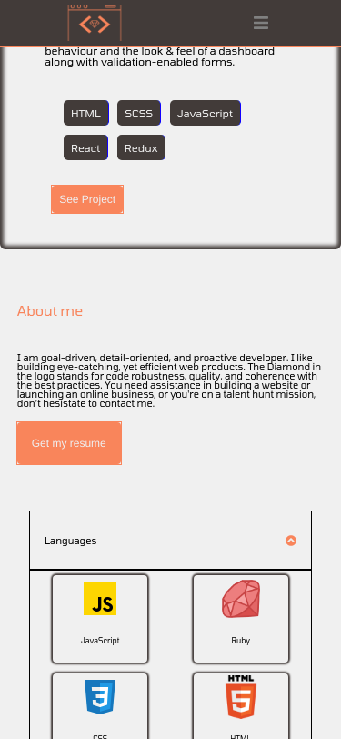
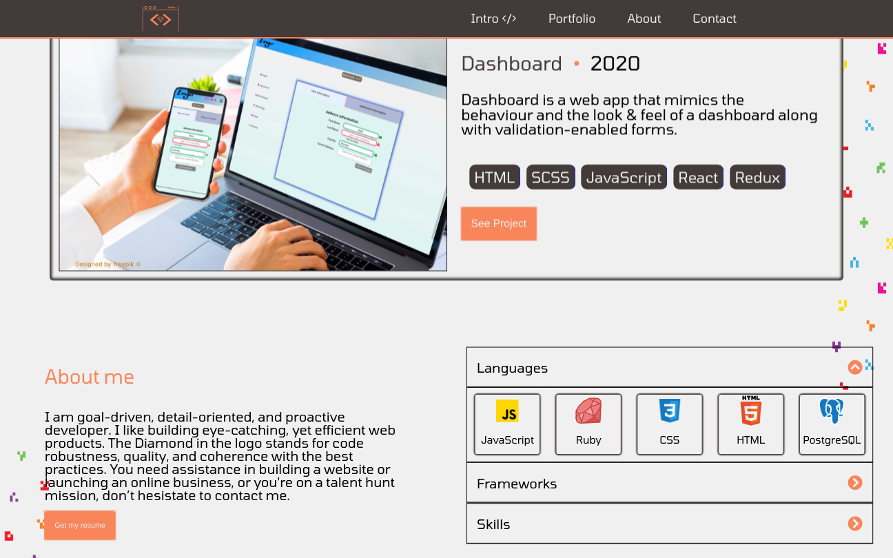

# 💻 Portfolio

<div align="center">

</div>



- Portfolio Page is a web app in which I present a collection of my best web projects.

### Technologies Used

In this app we used the following technologies:

HTML | CSS(SASS) | Javascript | React 
------------ | ------------- | ----------- | -----------
 |  |  | 


## ✨ Live Demo

You can look at it [here](http://ahmed-mahfoudh.netlify.com/)

## 🚀 Getting Started

To get a local copy up and running follow these simple example steps.

### Clone

```sh
git clone git@github.com:stratospherique/Portfolio-page.git
cd Portfolio-page
```

### Install

```sh
npm install
```

### Usage

```sh
npm start
```

## :pencil2: Todo
- Tests to be added

## Author

:male_detective: Ahmed Mahfoudh

- [Github](https://github.com/stratospherique)
- [Linkedin](https://www.linkedin.com/in/ahmed-mahfoudh/)
- [Twitter](https://twitter.com/AhmedMahfoudh8)
- [Email](mailto:ahmed.mahfoudh1991@gmail.com?subject=Website%20Inquiry)

## 🤝 Contributing

Contributions, issues and feature requests are welcome!

Feel free to check the [issues page](issues/).

## Show your support

Give a ⭐️ if you like this project!

> “There is no exercise better for the heart than reaching down and lifting people up.”
John Holmes